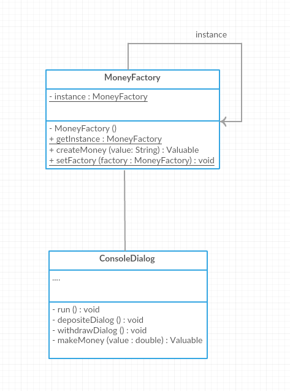
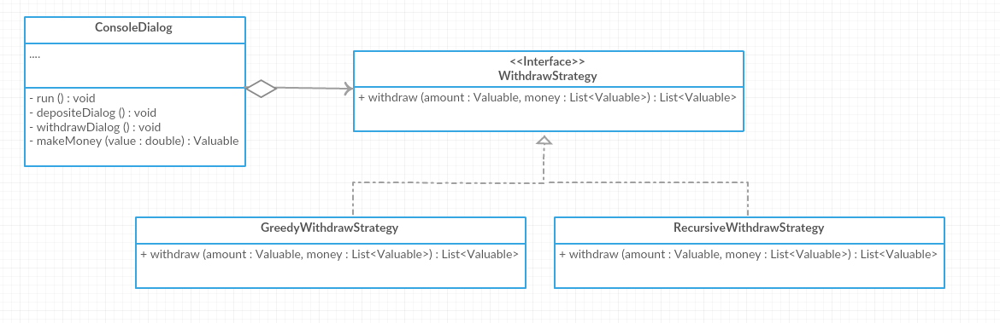
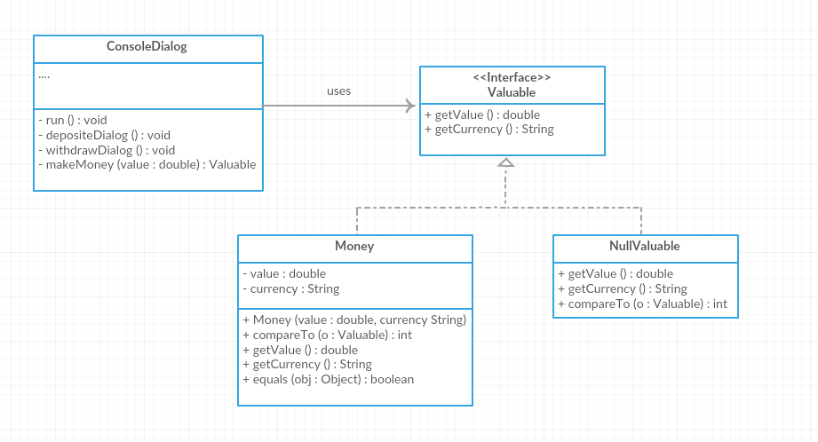

# Final Project SSD lab
## Installation guide and How to run
```
> git clone https://github.com/First529/Final_Project.git
> Run Main.java in any IDE
```

## Description
A purse application where you can insert and withdraw money from your own purse, which also include a validator whether it's a real money from that currency or not.
 
 
**List of available currencies**
- Thai Baht
- Malaysian Ringgit
## Design Patterns
### Singleton Design Pattern
- In the diagram below, MoneyFactory.class uses this pattern so that there can be only one instance of this object. As it gets shared by multiple objects
it may be costly if we don't use this pattern. 



### Strategy Design Pattern
- In the diagram below, when you called the withdraw method it will returns your money from the purse base on what strategy did you choose to withdraw your money (lowest -> highest or highest -> lowest)
 


### Null Object Design Pattern
- The objective of this pattern is to use as a validator in the createmoney method in the MalayMoneyFactory.class and ThaiMoneyFactory.class so that we don't have to throw an exception or return a null value instead just return NullValuable that implements that interface (below is a partial diagram to show the use of this pattern).


